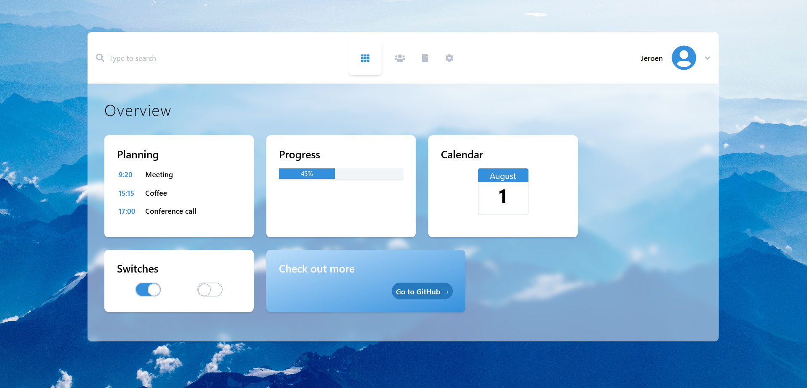

# Crosswind



[![Latest Version on Packagist][ico-version]][link-packagist]
[![Build Status][ico-travis]][link-travis]
[![StyleCI][ico-styleci]][link-styleci]

Take a look at [contributing.md](contributing.md) to see a to do list.

## Installation

Via Composer

``` bash
$ composer require jeroen-g/crosswind
```

## Usage

To get started with all the assets etc., run the publish command and choose the option for the `CrosswindServiceProvider`.
```bash
$ php artisan vendor:publish
```

You will get the following files:
- in `resources/assets/vendor/crosswind` the unprocessed css/js files.
- in `resources/views/vendor/crosswind` the Blade view files.
- in `public/vendor` the processed css/js files and the background image.

### Crosswind Preset
Work in progress.

### Tailwind configuration
Work in progress.

### Blocks
Work in progress.

## Used libraries
- [Tailwind CSS](tailwindcss.com/)
- [Font Awesome](https://fontawesome.com/)

## Change log

Please see the [changelog](changelog.md) for more information on what has changed recently.

## Contributing

Please see [contributing.md](contributing.md) for details and a todolist.

## Credits

- [JeroenG][link-author]
- [All Contributors][link-contributors]

The design is based on [this Dribble](https://dribbble.com/shots/4692934-Dashboard-Design).

## License

EUPL-1.1. Please see the [license file](license.md) for more information.

[ico-version]: https://img.shields.io/packagist/v/jeroen-g/crosswind.svg?style=flat-square
[ico-travis]: https://img.shields.io/travis/jeroen-g/crosswind/master.svg?style=flat-square
[ico-styleci]: https://styleci.io/repos/12345678/shield

[link-packagist]: https://packagist.org/packages/jeroen-g/crosswind
[link-travis]: https://travis-ci.org/jeroen-g/crosswind
[link-styleci]: https://styleci.io/repos/12345678
[link-author]: https://github.com/jeroen-g
[link-contributors]: ../../contributors